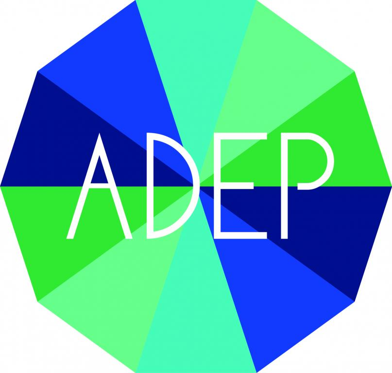

# doty  
## week presentation  
### Allez plus loin avec Simplon 
Entreprise de l’économie sociale et solidaire (agrément ESUS), Simplon.co est un réseau de « fabriques » (écoles) qui propose des formations GRATUITES pour devenir développeur de sites web et d’applications mobiles, intégrateur, référent numérique, datartisan, e-commerçant… et bien d’autres métiers numériques “en tension” qui permettent de trouver rapidement un emploi ou de créer sa propre activité.  

  
Reussir sa vie avec l'adep
  
